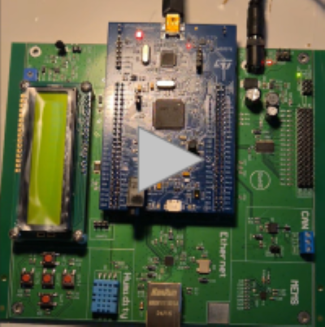

# STM32F407G-DISC1 LED Pattern Controller 💡

An embedded C project for STM32F407G-DISC1 microcontrollers that implements an interactive, interrupt-driven LED blinking controller. The system manages 4 LEDs and allows the user to switch between various blinking schemes and adjust their speed in real-time using 5 push buttons.

## 🚀 Features

* **Multiple Blinking Schemes:** Includes 4 distinct patterns (`All Blink`, `Two Diodes`, `Police`, and `Snake`).
* **Dynamic Speed Control:** Real-time adjustable blinking delay (from 100ms to 1000ms).
* **Start/Stop Functionality:** Safely pauses the sequence and immediately turns off all LEDs.
* **Event-Driven Architecture:** Button inputs are handled via External Interrupts (EXTI), ensuring a responsive and non-blocking main loop.

## 🎮 Hardware Controls

The project uses 5 external buttons mapped to the following actions:

| Button | Pin | Function | Description |
| :--- | :--- | :--- | :--- |
| **Middle** | `PA15` | **Start / Stop** | Toggles the blinking process on and off. |
| **Right** | `PC6` | **Next Pattern** | Switches to the next LED blinking scheme. |
| **Left** | `PC8` | **Previous Pattern** | Returns to the previous LED blinking scheme. |
| **Up** | `PC9` | **Speed Up** | Decreases the delay by 50ms (makes it blink faster). |
| **Down** | `PC11` | **Slow Down** | Increases the delay by 50ms (makes it blink slower). |

*Note: The project utilizes the onboard LEDs of the STM32F407G-DISC1 board mapped to `GPIOD` (PD15 - Blue, PD14 - Red, PD13 - Orange, PD12 - Green).*

## 🎥 Video Demonstration
Click the image below to watch the hardware demonstration video on Google Drive:

## 🛠️ Software Architecture highlights

* **State Machine:** Uses a custom `BlinkPattern` struct to define steps, masks, and durations for each pattern entirely in the Flash memory.
* **Non-blocking Interrupts:** The EXTI callbacks only manipulate state flags and lightweight variables, leaving the heavy lifting (like `HAL_Delay`) to the main `while(1)` loop. This prevents processor freezing and priority inversion.

## ⚙️ How to build

1. Clone this repository.
2. Open the project in **STM32CubeIDE**.
3. Build the project and flash it onto your **STM32F407G-DISC1** development board.